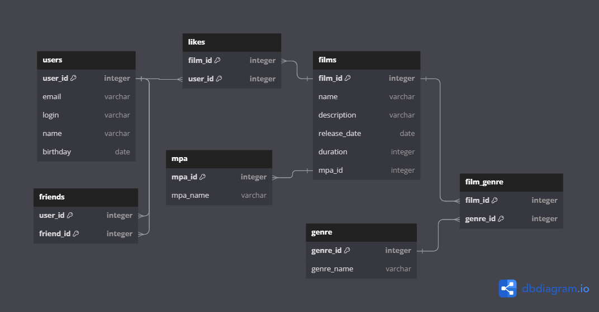

# java-filmorate
Template repository for Filmorate project.

Выполненные задачи:  
-Добавлена функциональность "Отзывы"  
-Добавлена функциональность "Поиск"  
-Добавлена функциональность "Общие фильмы"  
-Добавлена функциональность "Рекомендации"  
-Добавлена функциональность "Лента событий"  
-Добавлена функциональность "Удаление фильмов и пользователей"  
-Добавлена функциональность "Добавление режиссеров в фильмы"  
-Добавлена функциональность "Вывод топ-N фильмов по количеству лайков, с сортировкой по жанрам и событиям"